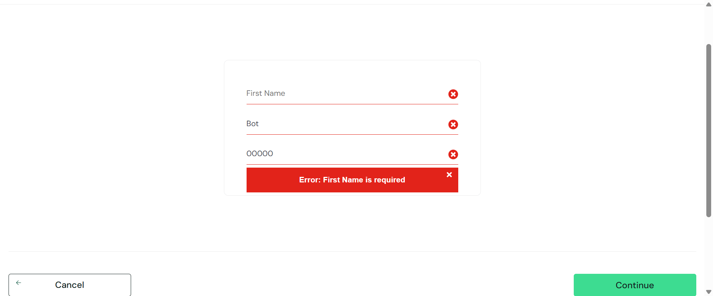

# :test_tube: Selenium Web Testing – SauceDemo

[](https://github.com/soin8293/Selenium-Web-Testing/actions)
[](https://github.com/soin8293/Selenium-Web-Testing?quickstart=1)


Automated functional tests written in **Python 3.12** with **Selenium 4** against the live e-commerce sandbox <https://www.saucedemo.com>.

---

## :camera_flash: Demo



*(The GIF is rebuilt on every run from fresh screenshots.)*

---

## :toolbox: Tech Stack

| Tool / Library        | Purpose                                   |
| --------------------- | ----------------------------------------- |
| **Selenium 4**        | Browser automation                        |
| **WebDriver Manager** | Auto-installs the matching ChromeDriver   |
| **ImageIO**           | Builds `demo.gif` from screenshots        |
| **GitHub Actions**    | CI workflow (headless Chrome)             |

---

## :white_check_mark: Test Scenarios

| Flow           | Steps (high-level)                                           | Expected Result            |
| -------------- | ------------------------------------------------------------ | -------------------------- |
| **Positive ?** | Log in ? add 2 items ? checkout ? finish                    | “Thank you for your order” |
| **Negative ?** | Log in ? add 1 item ? leave **First Name** blank ? checkout | Validation error banner    |

Each flow ends with a PNG screenshot saved to **`screenshots/`**.

---

## :rocket: Quick Start

```bash
git clone https://github.com/soin8293/Selenium-Web-Testing.git
cd Selenium-Web-Testing
pip install -r requirements.txt
python web_test.py
```

* Screenshots appear in `screenshots/`.  
* A new **`demo.gif`** is generated automatically.  
* Chrome password-manager pop-ups are disabled via Incognito + feature flags.

---

## :test_tube: Continuous Integration

`.github/workflows/ci.yml` runs on every push:

1. Install dependencies  
2. Launch headless Chrome  
3. Execute both tests  
4. Upload screenshots as an artifact  

The green **CI** badge at the top reflects the latest status.

---

## :file_folder: Project Structure

```
Selenium-Web-Testing/
+- web_test.py          # Selenium tests (unittest)
+- requirements.txt     # Dependencies
+- README.md            # This file
+- demo.gif             # Auto-generated test run
+- screenshots/         # Saved PNGs
+- .github/workflows/   # GitHub Actions CI
```

---

## :computer: Requirements

* Google Chrome  
* Python 3.12+  
* Internet access (tests hit SauceDemo live site)  

_No manual ChromeDriver download required—`webdriver-manager` handles it._

---

## :book: License

MIT License — free to use, modify, and share.