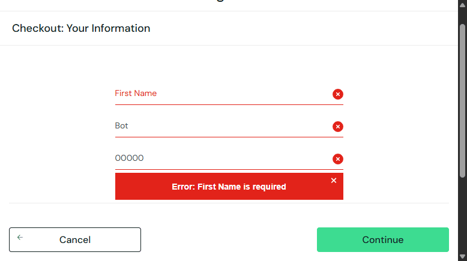

# Selenium Web Testing — SauceDemo

[](https://github.com/soin8293/Selenium-Web-Testing/actions)
[](https://github.com/soin8293/Selenium-Web-Testing?quickstart=1)


An educational Python/Selenium project that turns checkout, authentication,
and basic accessibility requirements into repeatable browser tests against the public
[SauceDemo](https://www.saucedemo.com/) sandbox.

## What this demonstrates

- Translating positive and negative user flows into executable checks
- A small page-object layer that separates navigation from assertions
- Explicit waits instead of fixed timing for page-state assertions
- Headless Chrome execution in GitHub Actions
- Screenshot artifacts and a small run GIF for review
- Negative coverage for validation and locked accounts
- Lightweight checks for document language/title and accessible names
- A process exit code that fails CI when any unittest fails

## Test scenarios

| Flow | Steps | Expected result |
|---|---|---|
| Positive checkout | Sign in, add two items, provide checkout details, finish | Order-completion heading appears |
| Missing first name | Sign in, add one item, omit the first name | Validation banner mentions the missing first name |
| Locked account | Attempt sign-in with the sandbox's locked user | Authentication error identifies the lockout |
| Accessibility smoke | Inspect login and inventory pages | Login basics pass; the known empty-cart accessible-name gap is surfaced |

## Demo



## Run locally

Requirements:

- Python 3.12+
- Google Chrome
- Internet access to the third-party SauceDemo sandbox

```bash
git clone https://github.com/soin8293/Selenium-Web-Testing.git
cd Selenium-Web-Testing
python -m pip install -r requirements.txt
python web_test.py
```

Screenshots are written under `screenshots/` while the suite runs. Local runs
combine successful screenshots into `demo.gif` and remove the intermediate
PNGs. CI retains both the screenshots and GIF as workflow artifacts.

## Continuous integration

`.github/workflows/ci.yml` runs the four scenarios in headless Chrome on each push
and pull request. The command exits nonzero if either unittest fails, so the CI
badge represents the browser assertions rather than only script completion.

## Project structure

```text
.
├── .github/workflows/ci.yml
├── demo.gif
├── pages.py
├── requirements.txt
├── screenshots/
└── web_test.py
```

## Scope and limitations

This is a bounded educational functional-test project, not production QA,
security testing, a WCAG conformance audit, performance testing, or a Sauce
Labs project. The accessibility assertions are deliberately narrow smoke
checks, not a replacement for automated rules engines, assistive-technology
testing, or human review. It depends on a public third-party sandbox, so upstream UI or account
changes can break selectors or credentials without a change to this repository.

## Author

Sorbarikor Inene — [@soin8293](https://github.com/soin8293)

## License

MIT. See [`LICENSE`](LICENSE).
